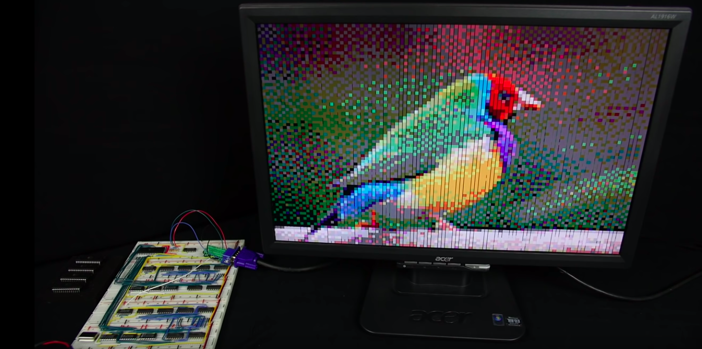

# Házi

Mindegyik feladat határideje **kedd (14.) éjfél**.


### 0. Operatív

Hozzatok létre a `members` mappán belül egy saját (bece-/fantázia-)nevetekkel (ékezetek, szóközök nélkül) ellátott almappát. Ide fogjátok tölteni majd a házikat.


## 1. Gyakorlat

A következő állításokat fejezzétek ki paraméterek, kvantorok és logikai műveletek segítségével. A megoldásokat létrehozhatjátok elektronikusan, de befotózott, tollal írt jegyzetet is elfogadunk. A lényeg, hogy átlátható és olvasható legyen. A kész megoldást töltsétek fel a fent létrehozott mappába.

**Predikátumok:**
- F(x): *x férfi*
- N(x): *x nő*
- P(x, y): *y személy x személy gyereke*

**Kifejezendő állítások:**
- A) *k-nak és d-nek van közös lánya*
- B) *csak a férfiak között vannak gyermektelenek*
- C) *vannak egynemű testvérek*

 Segítségnek a ```symbols_exercise.pdf``` fájlban találjátok a kurzuson használt jelöléseket, és a szexuális feladatok megoldását.


## 2. Elmélet

Nézzétek meg az alábbi két videót:
- [Learn how computers add numbers and build a 4 bit adder circuit](https://www.youtube.com/watch?v=wvJc9CZcvBc&feature=share&fbclid=IwAR1hnwQuJA0fN8JhTg2CDeI-2woN3xIBzKuXtIzeVdVHzfE46cfc05H3XDM): ebben egy faszi bemutatja, hogyan áll össze egy bonyolultabb összeadó, és ténylegesen meg is építi a gépet.
- [other video related to formal logic](link)


A Deepnote-os fórumra posztolni fogunk kérdéseket a videókkal kapcsolatban, amelyek közül mindegyikőtöknek **tetszőlegesen választott kettőt meg kell válaszolnia** komment formájában, szintén a nyilvános fórumon. Ez first come, first served alapon megy, tehát ha valaki már elvitte a kedvenc kérdéseteket, kénytelenek lesztek másikat választani.


### +1 Érdekességnek

Ha mélyebben érdekel a bináris összeadós téma, érdemes megnézni ezt a kétrészes videósorozatot is:
- [első](https://www.youtube.com/watch?time_continue=738&v=l7rce6IQDWs&feature=emb_logo&fbclid=IwAR2gdCGpGMqVgul2H6PUMcpmJGR3Zq-3zvka-qWTwoFcoEgR56IKRoNjQIA)
- [második](https://www.youtube.com/watch?v=uqY3FMuMuRo&feature=youtu.be&fbclid=IwAR3I1DtZ5T_X8mFlfBGPiF_UAgGnrNGYDqjw9GmJWc1e8wug5rU8Ag8tpyA)),
ahol bináris összeadók segítségével létrejön az alábbi kép egy madárról.


